# RPG Inspection - Lost Ark 스펙 검사기

  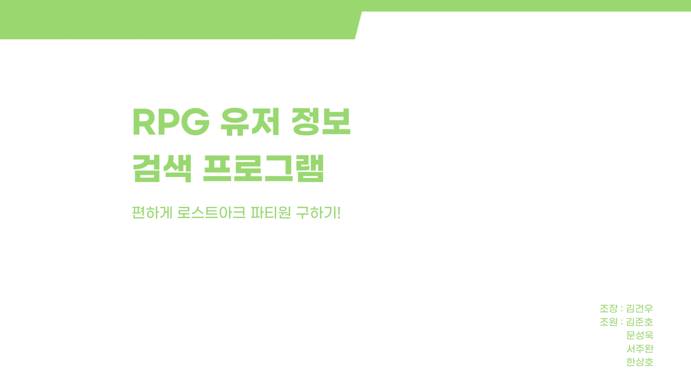

  > Lost Ark 레이드 파티 구성을 위한 스펙 검사 자동화 도구

## 📌 프로젝트 소개
Lost Ark 레이드 파티 구성 시 발생하는 스펙 확인의 불편함을 해소하기 위한 웹 기반 스펙 검사 도구입니다.

## 🔍 주요 기능

### 스펙 자동 검사

  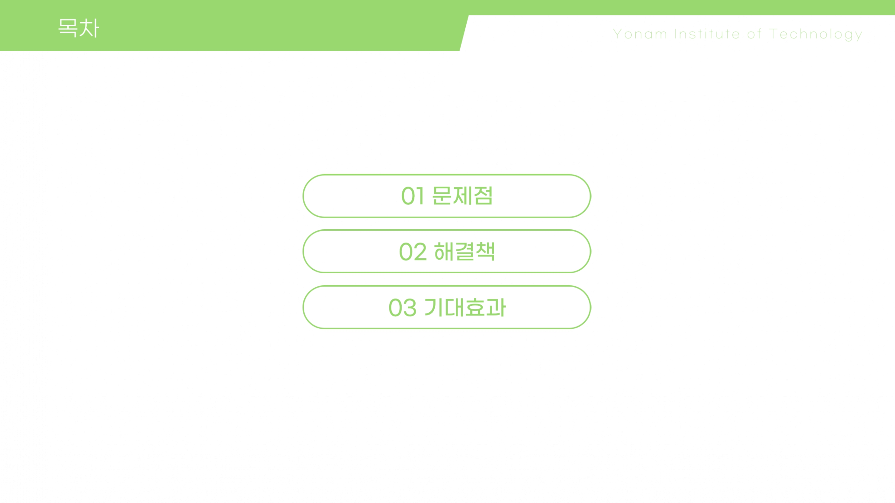
  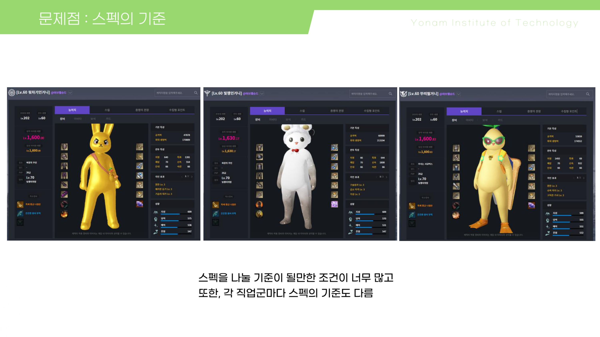
  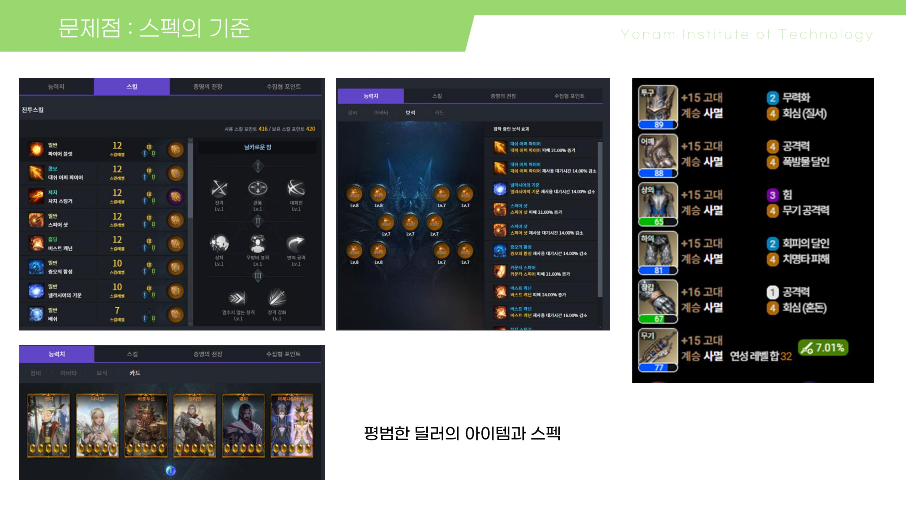
   
  <i>캐릭터 스펙 자동 인식 및 분석</i>

- 아이템 레벨 확인
- 보석 단계 및 효과 분석
- 카드 세트 효과 검증

### 직관적인 UI

  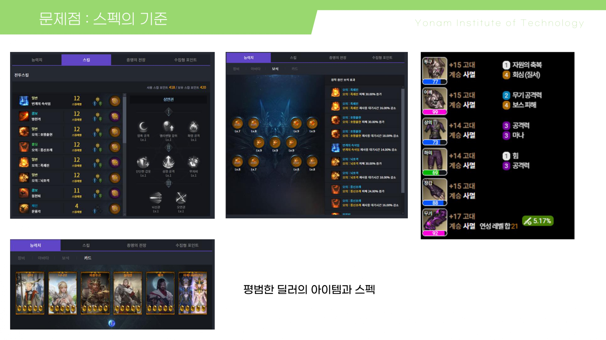
  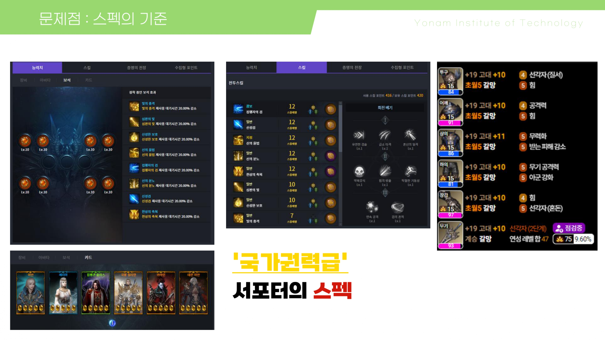
   
  <i>한 눈에 보는 스펙 정보</i>

- 실시간 스펙 체크
- 시각적 데이터 표현
- 사용자 친화적 인터페이스

### 레이드별 기준 제시

  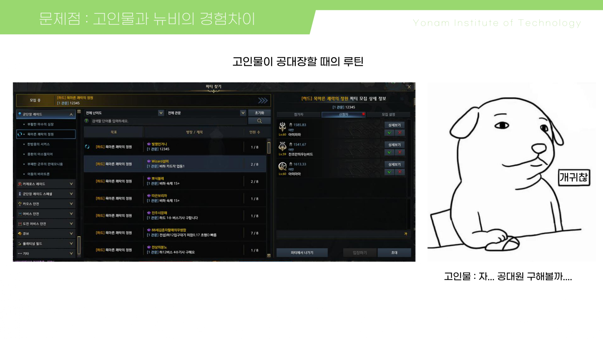
  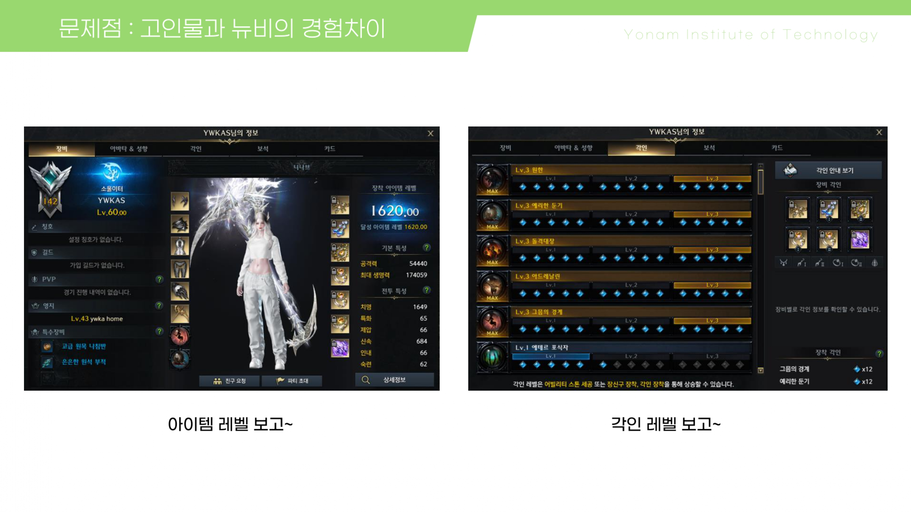
   
  <i>레이드별 권장 스펙 가이드</i>

## 🎮 사용 예시
### 고인물을 위한 기능

  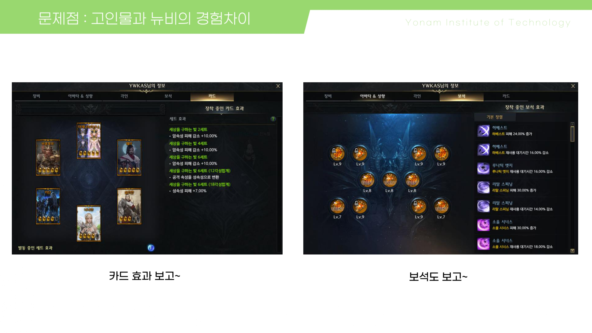
  

- 원클릭 스펙 체크
- 빠른 파티 구성
- 효율적인 멤버 관리

### 뉴비를 위한 가이드

  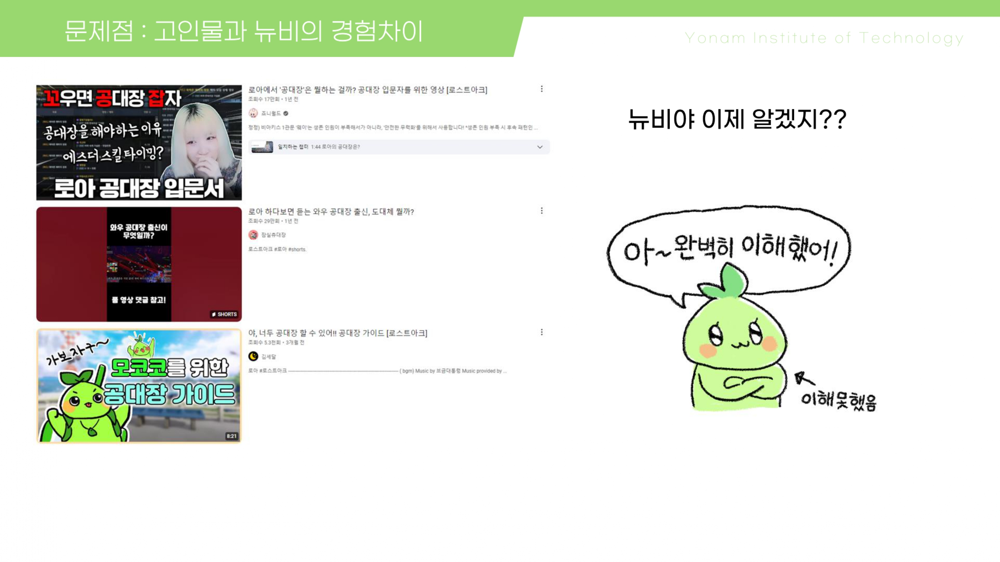
  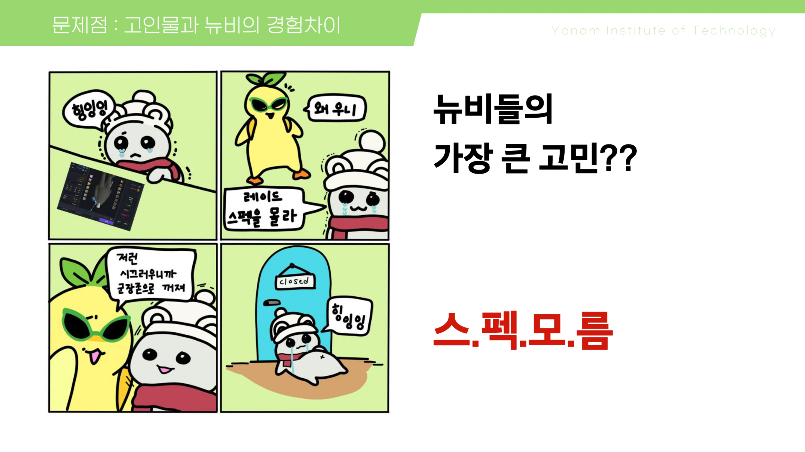

- 적정 스펙 기준 제시
- 레이드별 요구사항 안내
- 진입 장벽 완화

## 🚀 개발 예정 기능
### 차단 유저 필터링 시스템
- Lost Ark API 연동
- 차단 목록 자동 인식
- 파티 매칭 시 차단 유저 자동 필터링

### 개선 배경
- 현재 게임 내 차단 시스템의 한계
  - 제3자 파티에서 차단 유저 확인 불가
  - 원정대 단위 부캐릭터 식별 어려움
- 자동화된 차단 유저 확인으로 원활한 파티 플레이 지원

## 🛠 기술 스택
- **Frontend**: React.js
- **API 연동**: Lost Ark Open API
- **이미지 처리**: OCR API
- **배포**: Docker, AWS

## 📚 문서
- [사용자 가이드](./docs/USER_GUIDE.md)
- [개발자 문서](./docs/DEVELOPER.md)
- [API 문서](./docs/API.md)

