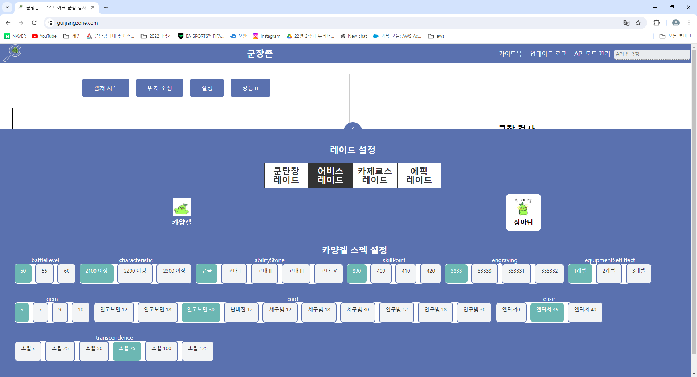
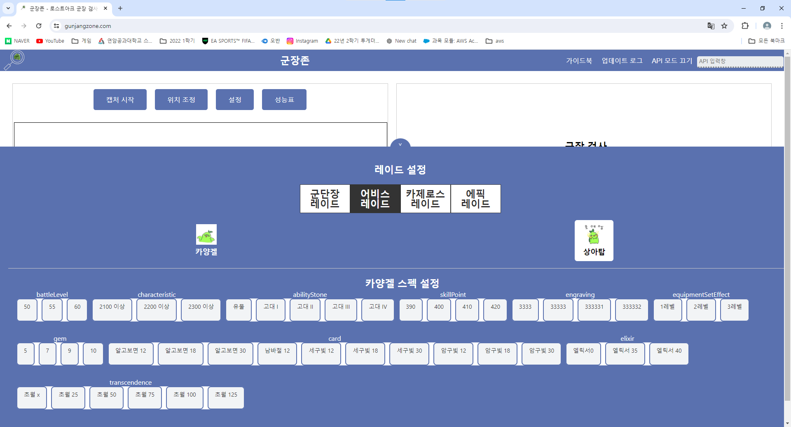
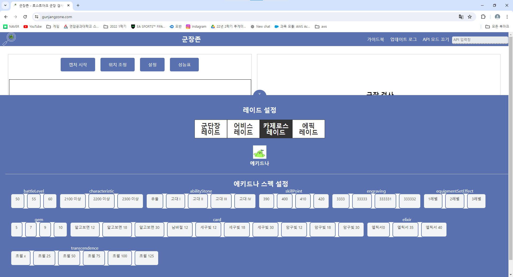

# 06.05 수정사항
### 버튼 클릭 수정

버튼별 하나씩 클릭 되도록 수정
#
### css 수정 사항
###
버튼 hover시 테두리 없애기
###
버튼 클릭시 색 변경
#
### 레이드별 보스 정리

# 06.06 수정사항
### 기본 설정 및 사용자 설정 라디오버튼

### 기본 설정 값 

기본 설정값일때는 설정따로 못하게 수정

사용자 설정일때는 수정 가능  

### 문제 사항
  // 로컬 스토리지에서 사용자 설정값을 불러와서 설정 상태를 업데이트하는 함수
  const loadOptionsFromLocalStorage = () => {
    const storedOptions = localStorage.getItem('epicRaidOptions');
    if (storedOptions) {
      setSelectedOptions(JSON.parse(storedOptions));
    }
  };

  // 추가된 useEffect 훅: 로컬 스토리지에서 사용자 설정값을 불러와서 설정 상태를 업데이트
  useEffect(() => {
    loadOptionsFromLocalStorage();
  }, []);
로컬스토리지 저장이 되는지....?